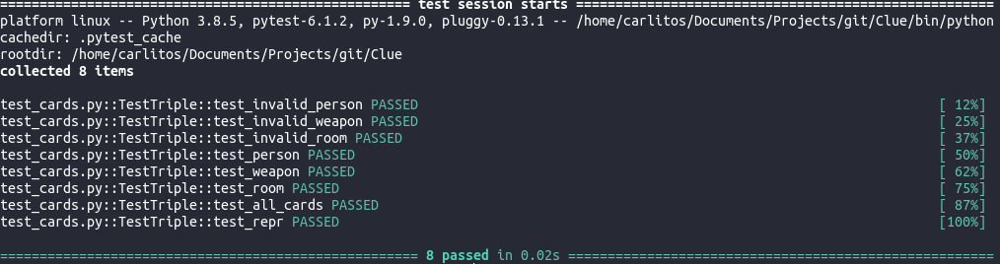
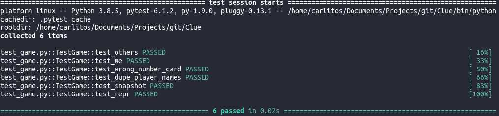

# Clue Game Solver
> Benzon Carlitos Salazar

## About
This is a repo that consists of mainly test cases to showcase my skills in unit
testing using the game of Clue to solve cases as an example and also using 
Python's ***pytest*** and ***unittest***. The main folder for the game is 
[here](./src/clue), and all the important test cases are [here](./tests)

## Test cases implemented
* [Test folder](./tests)
	* [Test card triples](./tests/test_cards.py)
	
	* [Test game functions](./tests/test_game.py)
	
	* [Test players functions](./tests/test_player.py)
	
	* [Test command-line interface](./tests/test_cli.py) -- ***In progress***